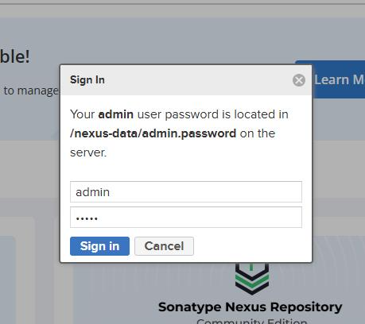
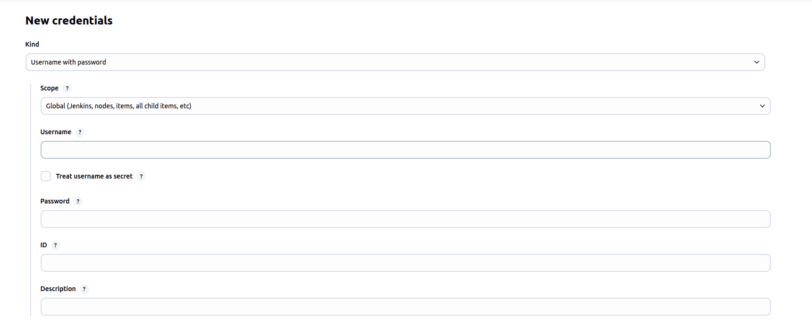
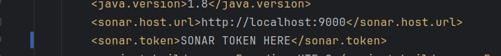
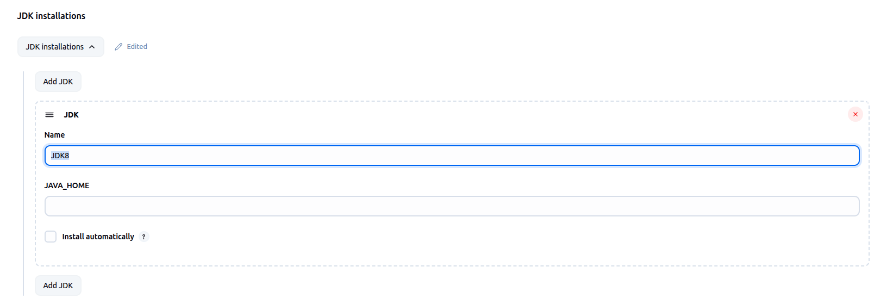
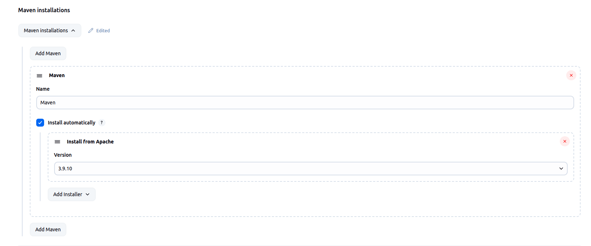
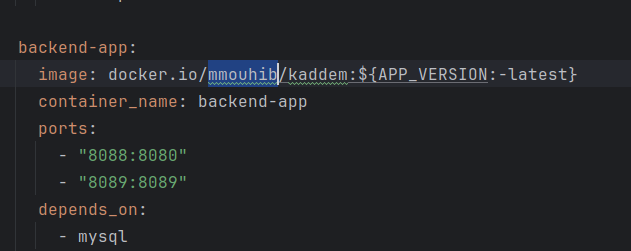
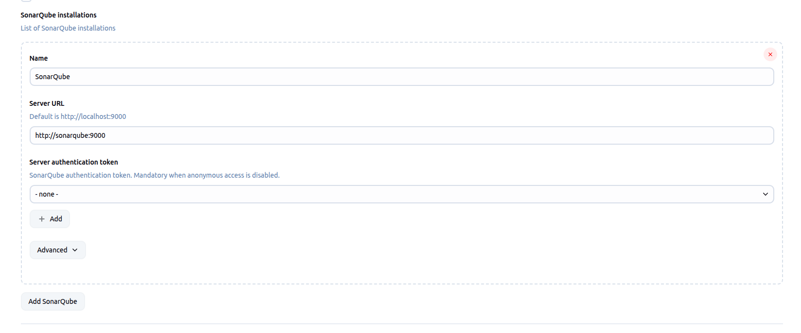
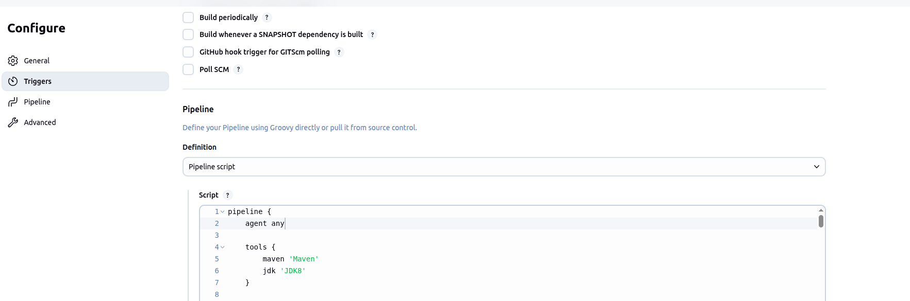
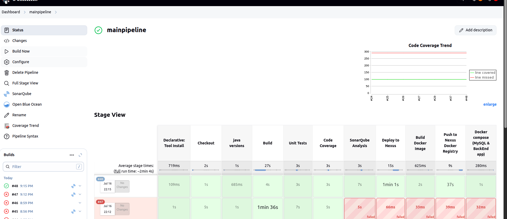
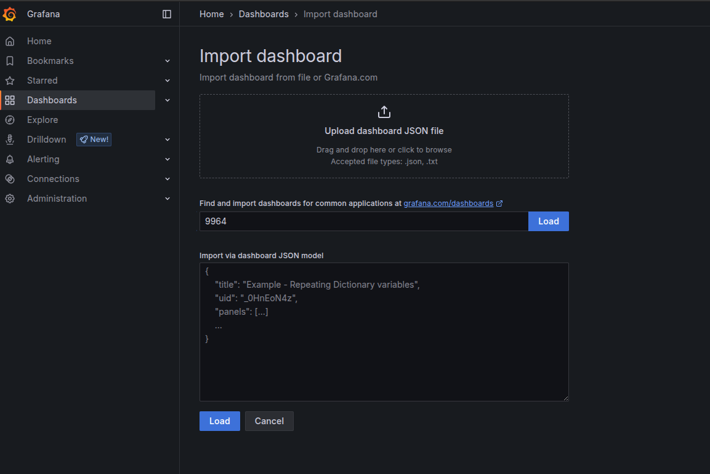

# Project Setup Instructions

**DO NOT CHANGE THE ROOT FOLDER NAME (`pi`)**

---

## Default Credentials

- **Grafana**
  - **User:** `admin`
  - **Password:** `admin@123`
- **Nexus**
  - **User:** `admin`
  - **Password:** {refer to step}

---

## Requirements

- WSL or any Linux machine
- Docker and Docker Compose available in the CLI

---

## 1. Clone and Prepare Your Own Repository

1. Clone this repository:
   ```sh
   git clone https://github.com/mmouhib/pi.git
   ```
2. Delete the `.git` folder:
   ```sh
   cd pi
   rm -rf .git
   ```
3. Create a new repository on your own GitHub account.
4. Initialize a new git repo and push:
   ```sh
   git init
   git remote add origin https://github.com/{your-username}/{your-repo}.git
   git add .
   git commit -m "Initial commit"
   git branch -M main
   git push -u origin main
   ```
5. Edit the `Jenkinsfile` and change the `git` URL to your new repository and branch (`main` by default).

---

## 2. Run the Project

```sh
docker compose up jenkins sonarqube nexus grafana prometheus -d
```

---

## 3. Change Nexus Password

1. Open a terminal and access the Nexus container:
   ```sh
   docker exec -it nexus bash
   ```
2. Display the initial admin password:
   ```sh
   cat /nexus-data/admin.password | grep ""
   ```
3. Open Nexus at [http://localhost:8081](http://localhost:8081) and log in:
   - **User:** `admin`
   - **Password:** `{the password you found}`
4. Change the password to `admin` for easier access.
   

---

## 4. Add Docker Hub Credentials in Jenkins

- Go to: [Jenkins Credentials](http://localhost:8080/manage/credentials/store/system/domain/_/)
- Generate a token from [Docker Hub Security Settings](https://hub.docker.com/settings/security) ⇒ *Personal access token*
- Add credentials:
  - **ID:** `nexus-docker-credentials`
  - **Username:** `{your dockerhub username}`
  - **Password:** `{the generated token}`
- Example:  
  

---

## 5. Add SonarQube Credentials in Jenkins

- Go to: [Jenkins Credentials](http://localhost:8080/manage/credentials/store/system/domain/_/)
- Use the following:
  - **ID:** `sonar-credentials`
  - **Username:** `admin`
  - **Password:** `+ANJ#KKrtN4S$n_`

---

## 6. Generate a SonarQube Token

- Log in to SonarQube (port 9000).
- On first login, change the password:
  - **Old password:** `admin`
  - **New password:** `+ANJ#KKrtN4S$n_`
- Visit: [SonarQube Account Security](http://localhost:9000/account/security)
- Add your token to `pom.xml`:  
  

---

## 7. Add JDK Dependency in Jenkins

- Go to: [Jenkins Global Tool Configuration](http://localhost:8080/manage/configureTools/)
- Add JDK (e.g., JDK 8 and JDK 17)
- 
- **DO NOT FORGET TO SAVE**

---

## 8. Add Maven Dependency in Jenkins

- Go to: [Jenkins Global Tool Configuration](http://localhost:8080/manage/configureTools/)
- Add Maven
- 
- **DO NOT FORGET TO SAVE**

---

## 9. Update Docker Compose for Backend App

- In `docker-compose.yml`, change the image tag for the `backend-app` service:
  - Replace `mmouhib` with your Docker Hub username.
- 

---

## 10. Add SonarQube URL in Jenkins

- Go to: [Jenkins Configure System](http://localhost:8080/manage/configure)
- Add the SonarQube URL.
- 
- **DO NOT FORGET TO SAVE**

---

## 11. Create a Jenkins Pipeline and Add the Jenkinsfile

1. In Jenkins, click **"New Item"**.
2. Enter a name for your pipeline and select **"Pipeline"**.
3. Click **OK**.
4. In the pipeline configuration, scroll to the **Pipeline** section.
5. Copy the content of your `Jenkinsfile` and paste it into the script box.
6. Save the pipeline.  
   

---

## 12. Run the Jenkins Pipeline

- Go to your pipeline in Jenkins.
- Click **"Build Now"**.
- Monitor the build process.  
  

---

## 13. Import Grafana Dashboards

After the pipeline succeeds:

- Visit [Grafana Import](http://localhost:3000/dashboard/import)
- Import the following dashboard IDs one by one:
  ```
  9964
  4701
  11378
  16459
  1860
  8321
  17642
  ```
- 